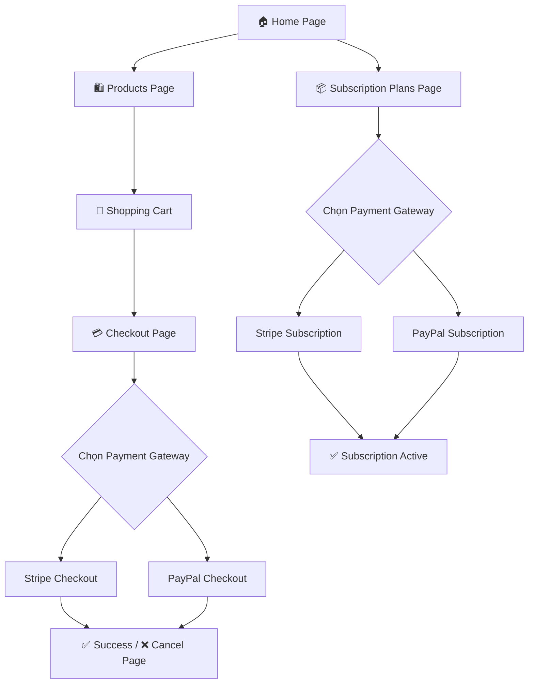
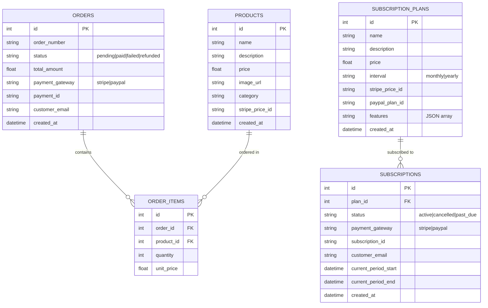
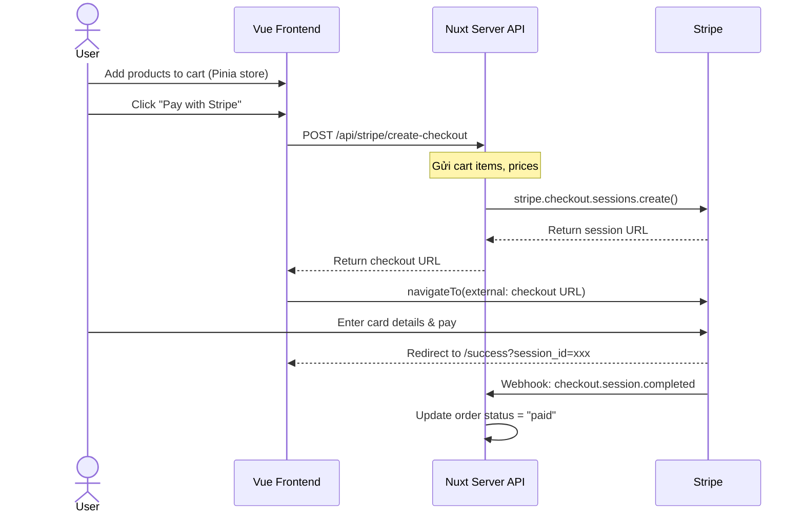
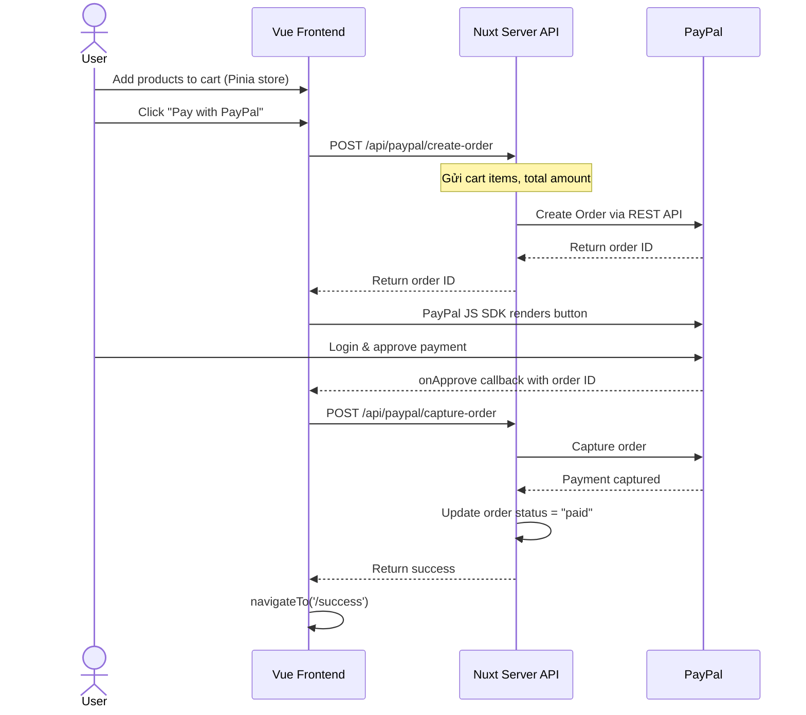
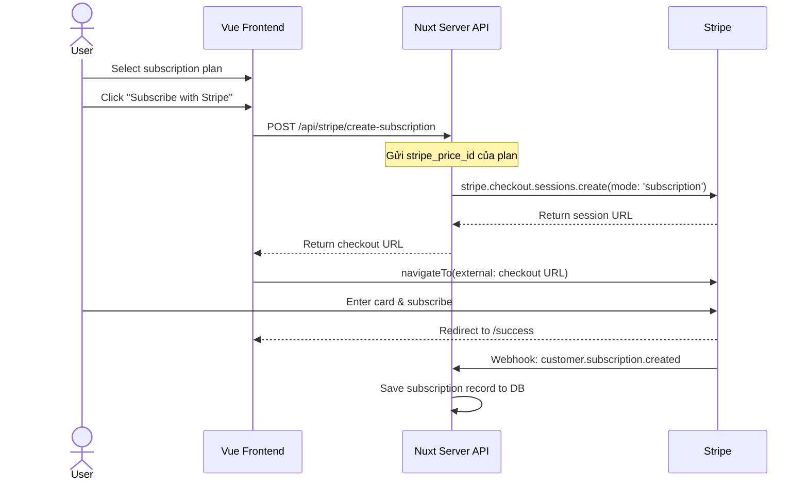
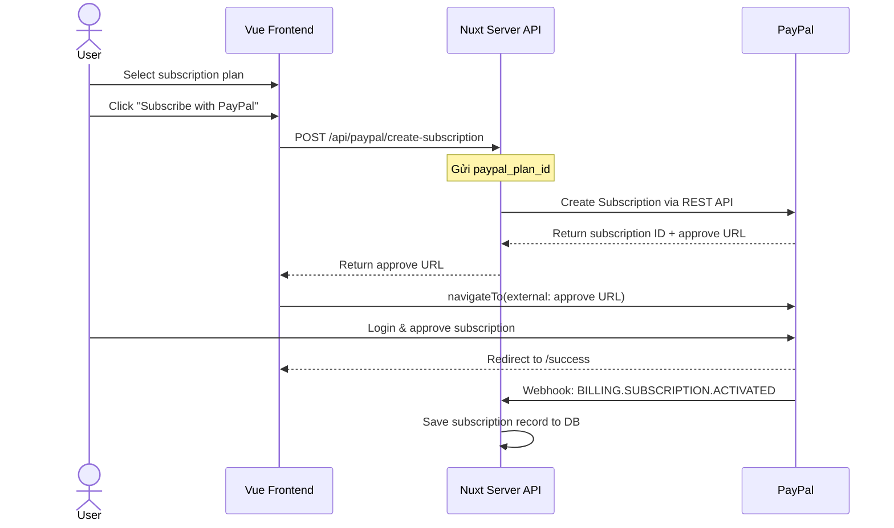

# 💳 Payment Integration Sample Project

## Implementation Plan — Stripe & PayPal

---

## 1. Tổng quan dự án

### Mục tiêu
Xây dựng một **demo web application** tích hợp thanh toán với **Stripe** và **PayPal**, hỗ trợ 2 luồng thanh toán:

| Luồng | Mô tả |
|-------|--------|
| 🛒 **Shopping Cart** | Chọn sản phẩm → Thêm giỏ hàng → Checkout → Thanh toán qua Stripe hoặc PayPal |
| 🔄 **Subscription** | Chọn gói subscription → Đăng ký → Thanh toán recurring qua Stripe hoặc PayPal |

### Demo Pages



---

## 2. Tech Stack

| Layer | Technology | Lý do |
|-------|-----------|-------|
| **Framework** | **Nuxt 3** | Vue 3 full-stack framework, server routes built-in, auto-imports |
| **Frontend** | **Vue 3** (Composition API) | Reactive, modern, cùng ecosystem |
| **UI Library** | **Naive UI** | Vue 3 component library, 80+ components, TypeScript support |
| **Styling** | **TailwindCSS v3** | Utility-first, rapid prototyping, kết hợp với Naive UI |
| **State Management** | **Pinia** | Official Vue store, devtools support |
| **Payment - Stripe** | Stripe Checkout + Stripe Billing | One-time & Subscription |
| **Payment - PayPal** | PayPal JS SDK + REST API | One-time & Subscription |
| **Database** | SQLite (via **better-sqlite3**) | Zero config, đủ cho demo |
| **Backend API** | Nuxt Server Routes (`server/api/`) | H3 framework, cùng codebase |

> [!NOTE]
> Project này là **sample/demo** nên sử dụng SQLite để đơn giản hóa setup. Trong production, nên dùng PostgreSQL/MySQL.

> [!TIP]
> **Naive UI + TailwindCSS**: Naive UI xử lý complex components (Modal, DataTable, Form...), TailwindCSS xử lý layout & custom styling. Tránh conflict bằng cách disable TailwindCSS preflight.

---

## 3. Cấu trúc thư mục

```
simple-shopping-card/
├── nuxt.config.ts                    # Nuxt configuration
├── tailwind.config.ts                # TailwindCSS configuration
├── app.vue                           # Root app component
│
├── assets/
│   └── css/
│       └── tailwind.css              # TailwindCSS directives + custom styles
│
├── pages/
│   ├── index.vue                     # 🏠 Home page
│   ├── products.vue                  # 🛍️ Products listing page
│   ├── cart.vue                      # 🛒 Shopping cart page
│   ├── checkout.vue                  # 💳 Checkout page (chọn payment method)
│   ├── subscriptions.vue             # 📦 Subscription plans page
│   ├── success.vue                   # ✅ Payment success page
│   └── cancel.vue                    # ❌ Payment cancel page
│
├── components/
│   ├── layout/
│   │   ├── AppHeader.vue             # Navigation header với Naive UI Menu
│   │   ├── AppFooter.vue             # Footer
│   │   └── CartBadge.vue             # Cart icon với badge count
│   │
│   ├── products/
│   │   ├── ProductCard.vue           # Product card (NCard based)
│   │   └── ProductGrid.vue           # Products grid layout
│   │
│   ├── cart/
│   │   ├── CartItem.vue              # Cart item row (NInputNumber)
│   │   └── CartSummary.vue           # Cart summary/total
│   │
│   ├── checkout/
│   │   ├── PaymentMethodSelector.vue # Stripe/PayPal tab selector (NTabs)
│   │   ├── StripeCheckoutButton.vue  # Stripe checkout trigger
│   │   └── PayPalCheckoutButton.vue  # PayPal checkout trigger
│   │
│   └── subscription/
│       ├── PricingCard.vue           # Subscription plan card
│       ├── PricingGrid.vue           # Plans comparison grid
│       └── PricingToggle.vue         # Monthly/Yearly toggle (NSwitch)
│
├── composables/
│   ├── useStripe.ts                  # Stripe client composable
│   └── usePayPal.ts                  # PayPal client composable
│
├── stores/
│   └── cart.ts                       # Pinia cart store
│
├── server/
│   ├── api/
│   │   ├── stripe/
│   │   │   ├── create-checkout.post.ts    # Tạo Stripe Checkout Session (one-time)
│   │   │   ├── create-subscription.post.ts # Tạo Stripe Subscription Session
│   │   │   └── webhook.post.ts            # Stripe Webhook handler
│   │   │
│   │   ├── paypal/
│   │   │   ├── create-order.post.ts       # Tạo PayPal Order
│   │   │   ├── capture-order.post.ts      # Capture PayPal Order
│   │   │   ├── create-subscription.post.ts # Tạo PayPal Subscription
│   │   │   └── webhook.post.ts            # PayPal Webhook handler
│   │   │
│   │   ├── products.get.ts                # GET products list
│   │   └── orders/
│   │       ├── index.get.ts               # GET orders list
│   │       └── index.post.ts              # POST create order
│   │
│   ├── utils/
│   │   ├── stripe.ts                      # Stripe server instance
│   │   ├── paypal.ts                      # PayPal server helpers
│   │   └── db.ts                          # SQLite database setup & seed
│   │
│   └── plugins/
│       └── db.ts                          # Auto-init database on startup
│
├── plugins/
│   └── naive-ui.ts                        # Naive UI plugin setup
│
├── public/
│   └── images/                            # Product images
│
├── docs/
│   └── payment_integration_plan.md        # This plan document
│
├── .env                                   # Environment variables
├── package.json
└── tsconfig.json
```

> [!IMPORTANT]
> **Nuxt 3 Conventions**:
> - `server/api/` — file-based API routing (`.get.ts`, `.post.ts` suffix = HTTP method)
> - `pages/` — file-based page routing (auto-generated)
> - `components/` — auto-imported components
> - `composables/` — auto-imported composable functions
> - `stores/` — Pinia stores

---

## 4. Database Schema



---

## 5. API Endpoints (Nuxt Server Routes)

### 5.1 Products & Orders

| Method | File | Endpoint | Mô tả |
|--------|------|----------|--------|
| `GET` | `products.get.ts` | `/api/products` | Lấy danh sách sản phẩm |
| `GET` | `orders/index.get.ts` | `/api/orders` | Lấy danh sách orders |
| `POST` | `orders/index.post.ts` | `/api/orders` | Tạo order mới |

### 5.2 Stripe APIs

| Method | File | Endpoint | Mô tả |
|--------|------|----------|--------|
| `POST` | `stripe/create-checkout.post.ts` | `/api/stripe/create-checkout` | Tạo Stripe Checkout Session (one-time) |
| `POST` | `stripe/create-subscription.post.ts` | `/api/stripe/create-subscription` | Tạo Stripe Checkout Session (subscription) |
| `POST` | `stripe/webhook.post.ts` | `/api/stripe/webhook` | Nhận webhook events từ Stripe |

### 5.3 PayPal APIs

| Method | File | Endpoint | Mô tả |
|--------|------|----------|--------|
| `POST` | `paypal/create-order.post.ts` | `/api/paypal/create-order` | Tạo PayPal Order |
| `POST` | `paypal/capture-order.post.ts` | `/api/paypal/capture-order` | Capture (confirm) PayPal Order |
| `POST` | `paypal/create-subscription.post.ts` | `/api/paypal/create-subscription` | Tạo PayPal Subscription |
| `POST` | `paypal/webhook.post.ts` | `/api/paypal/webhook` | Nhận webhook events từ PayPal |

---

## 6. Payment Flows Chi Tiết

### 6.1 🛒 Shopping Cart → Stripe Checkout



### 6.2 🛒 Shopping Cart → PayPal Checkout



### 6.3 🔄 Subscription → Stripe



### 6.4 🔄 Subscription → PayPal



---

## 7. Naive UI Components Mapping

Các Naive UI component sẽ được sử dụng trong project:

| Page/Feature | Naive UI Components |
|-------------|-------------------|
| **Layout** | `NLayout`, `NLayoutHeader`, `NLayoutContent`, `NLayoutFooter`, `NMenu`, `NBadge` |
| **Products** | `NCard`, `NButton`, `NGrid`, `NGi`, `NTag`, `NImage` |
| **Cart** | `NDataTable`, `NInputNumber`, `NButton`, `NDivider`, `NStatistic` |
| **Checkout** | `NTabs`, `NTabPane`, `NCard`, `NButton`, `NSpin`, `NResult` |
| **Subscription** | `NCard`, `NSwitch`, `NList`, `NListItem`, `NButton`, `NTag` |
| **Success/Cancel** | `NResult`, `NButton`, `NCard` |
| **Global** | `NMessageProvider`, `NDialogProvider`, `NNotificationProvider`, `NConfigProvider` |

---

## 8. Environment Variables

```env
# Stripe
STRIPE_SECRET_KEY=sk_test_xxxxx
STRIPE_WEBHOOK_SECRET=whsec_xxxxx

# PayPal
PAYPAL_CLIENT_ID=xxxxx
PAYPAL_CLIENT_SECRET=xxxxx
PAYPAL_WEBHOOK_ID=xxxxx
PAYPAL_MODE=sandbox

# App
NUXT_PUBLIC_BASE_URL=http://localhost:3000
NUXT_PUBLIC_STRIPE_PUBLISHABLE_KEY=pk_test_xxxxx
NUXT_PUBLIC_PAYPAL_CLIENT_ID=xxxxx
```

> [!NOTE]
> Nuxt 3 convention: `NUXT_PUBLIC_*` cho client-side env vars, không prefix cho server-only vars. Sử dụng `useRuntimeConfig()` để access.

---

## 9. Demo Pages Design

### 9.1 🏠 Home Page (`pages/index.vue`)
- Hero section giới thiệu demo với gradient background
- 2 `NCard` lớn: "🛒 Shopping Cart Demo" và "🔄 Subscription Demo"
- Mỗi card có description + CTA button
- Animated background, TailwindCSS glassmorphism

### 9.2 🛍️ Products Page (`pages/products.vue`)
- `NGrid` 3-4 cột hiển thị `ProductCard`
- Mỗi card: `NImage`, tên, giá (`NStatistic`), `NButton` "Add to Cart"
- `useMessage()` toast notification khi add thành công
- `CartBadge` component trên header với `NBadge`

### 9.3 🛒 Cart Page (`pages/cart.vue`)
- `NDataTable` liệt kê items trong giỏ hàng
- `NInputNumber` cho quantity, `NButton` icon xóa
- `CartSummary`: subtotal, tax, total với `NStatistic`
- 2 nút checkout: "Pay with Stripe" & "Pay with PayPal" (styled `NButton`)

### 9.4 💳 Checkout Page (`pages/checkout.vue`)
- Order review summary
- `NTabs` selector: Stripe tab / PayPal tab
- Stripe tab: `NButton` redirect to Stripe Checkout
- PayPal tab: PayPal JS SDK button rendered inline

### 9.5 📦 Subscription Plans Page (`pages/subscriptions.vue`)
- 3 `PricingCard`: Basic, Pro, Enterprise
- `NSwitch` toggle monthly/yearly
- Feature list với `NList` + checkmarks
- Mỗi plan có 2 `NButton`: "Subscribe via Stripe" & "Subscribe via PayPal"
- Highlighted "Popular" plan với `NTag`

### 9.6 ✅ Success Page (`pages/success.vue`)
- `NResult` component với status="success"
- Order/subscription details
- `NButton` "Continue Shopping" / "View Plans"

### 9.7 ❌ Cancel Page (`pages/cancel.vue`)
- `NResult` component với status="warning"
- `NButton` "Try Again" / "Go Home"

---

## 10. Implementation Phases

### Phase 1: Project Setup & Foundation
- [x] Initialize Nuxt 3 project (`npx nuxi@latest init`)
- [x] Install & configure TailwindCSS (`@nuxtjs/tailwindcss`)
- [x] Install & configure Naive UI (`naive-ui`, `@css-render/vue3-ssr-plugin`)
- [x] Setup Pinia store (`@pinia/nuxt`)
- [x] Setup SQLite database & seed data (`better-sqlite3`)
- [x] Create `AppHeader`, `AppFooter`, `CartBadge` layout components
- [x] Setup Naive UI global providers (`NMessageProvider`, etc.)

### Phase 2: Products & Cart Flow
- [x] Create `ProductCard.vue` & `ProductGrid.vue` components
- [x] Build Products page (`pages/products.vue`)
- [x] Implement Pinia cart store (`stores/cart.ts`)
- [x] Build Cart page (`pages/cart.vue`) với `NDataTable`
- [x] Add to cart + toast notification flow
- [x] `CartSummary` component với order total

### Phase 3: Stripe Integration
- [x] Setup Stripe server util (`server/utils/stripe.ts`)
- [x] Create `create-checkout.post.ts` API (one-time payment)
- [x] Create `create-subscription.post.ts` API
- [x] Create `webhook.post.ts` handler
- [x] Build `useStripe` composable
- [x] Build `StripeCheckoutButton.vue` component
- [x] Success/Cancel pages

### Phase 4: PayPal Integration
- [x] Setup PayPal server util (`server/utils/paypal.ts`)
- [x] Create `create-order.post.ts` API
- [x] Create `capture-order.post.ts` API
- [x] Create `create-subscription.post.ts` API
- [x] Create `webhook.post.ts` handler
- [x] Build `usePayPal` composable (load PayPal JS SDK)
- [x] Build `PayPalCheckoutButton.vue` component

### Phase 5: Subscription Plans
- [x] Build `PricingCard.vue`, `PricingGrid.vue`, `PricingToggle.vue`
- [x] Build Subscriptions page (`pages/subscriptions.vue`)
- [x] Stripe subscription checkout flow
- [x] PayPal subscription flow
- [x] Subscription status display

### Phase 6: Polish & Testing
- [x] Responsive design (TailwindCSS breakpoints)
- [x] Error handling & `NSpin` loading states
- [x] Animations & micro-interactions (CSS transitions + Vue Transition)
- [x] Dark mode support (Naive UI `NConfigProvider` theme)
- [x] Test mode payments end-to-end

---

## 11. Key Dependencies

```json
{
  "dependencies": {
    "naive-ui": "^2.40.0",
    "@css-render/vue3-ssr-plugin": "^0.15.14",
    "stripe": "^17.0.0",
    "@stripe/stripe-js": "^4.0.0",
    "better-sqlite3": "^11.0.0",
    "@pinia/nuxt": "^0.9.0",
    "pinia": "^2.3.0"
  },
  "devDependencies": {
    "nuxt": "^3.16.0",
    "@nuxtjs/tailwindcss": "^6.12.0",
    "tailwindcss": "^3.4.0",
    "autoprefixer": "^10.4.0",
    "postcss": "^8.4.0",
    "typescript": "^5.6.0"
  }
}
```

---

## 12. Nuxt Config Highlights

```typescript
// nuxt.config.ts
export default defineNuxtConfig({
  modules: [
    '@nuxtjs/tailwindcss',
    '@pinia/nuxt',
  ],

  // Naive UI SSR setup
  build: {
    transpile: ['naive-ui', 'vueuc', '@css-render/vue3-ssr-plugin'],
  },

  // Runtime config for env vars
  runtimeConfig: {
    stripeSecretKey: '',
    stripeWebhookSecret: '',
    paypalClientId: '',
    paypalClientSecret: '',
    paypalWebhookId: '',
    paypalMode: 'sandbox',
    public: {
      baseUrl: 'http://localhost:3000',
      stripePublishableKey: '',
      paypalClientId: '',
    },
  },

  // TailwindCSS: disable preflight to avoid conflict with Naive UI
  tailwindcss: {
    config: {
      corePlugins: {
        preflight: false,
      },
    },
  },
})
```

---

## 13. Lưu ý quan trọng

> [!IMPORTANT]
> **Stripe & PayPal Test Mode**: Project sử dụng sandbox/test keys. Cần tạo tài khoản test trên cả 2 platform trước khi chạy.

> [!WARNING]
> **Naive UI + TailwindCSS Conflict**: Phải disable TailwindCSS `preflight` (CSS reset) để không override Naive UI styles. Đã config sẵn trong `nuxt.config.ts`.

> [!WARNING]
> **Webhook Setup**: Để test webhook locally, cần dùng:
> - **Stripe**: `stripe listen --forward-to localhost:3000/api/stripe/webhook`
> - **PayPal**: Dùng PayPal Sandbox hoặc ngrok

> [!TIP]
> **Test Cards**:
> - Stripe: `4242 4242 4242 4242` (Visa success)
> - PayPal: Dùng sandbox buyer account

---

## 14. Câu hỏi đã được giải quyết

1. **Bạn đã có Stripe account (test mode) chưa?** → Đã setup sandbox config
2. **Bạn đã có PayPal Developer account chưa?** → Đã setup sandbox config
3. **Có muốn thêm tính năng authentication (login/register) không?** → Đã implement guest checkout với email capture
4. **Sản phẩm demo**: 8 sản phẩm công nghệ chất lượng cao (seeded)
5. **Ngôn ngữ giao diện**: Song ngữ Anh-Việt / Tiếng Anh chuyên nghiệp
