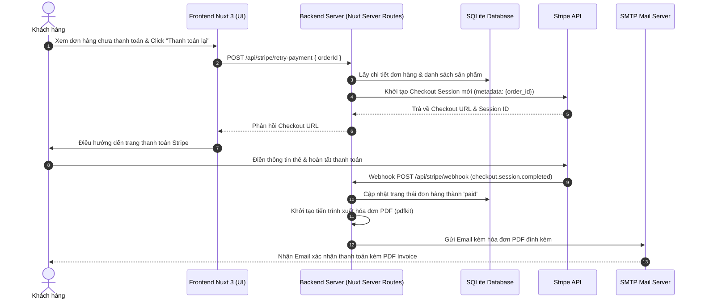

# Kế hoạch Triển khai: Thanh toán lại bằng Stripe, Tạo Hóa đơn PDF & Gửi Email

Tài liệu này mô tả chi tiết các bước thiết lập và phát triển tính năng cho phép người dùng thanh toán lại các đơn hàng chưa thành công thông qua Stripe Checkout Link, tự động tạo hóa đơn dạng PDF và gửi email xác nhận kèm hóa đơn sau khi nhận được Webhook thanh toán thành công.

---

## 1. Kiến trúc luồng xử lý (Workflow Architecture)



---

## 2. Các Bước Triển Khai Chi Tiết

### Bước 1: Cài đặt các thư viện cần thiết
Để phục vụ việc tạo PDF và gửi Mail, chúng ta cần cài đặt thêm các package sau:
```bash
npm install pdfkit nodemailer
npm install --save-dev @types/pdfkit @types/nodemailer
```

---

### Bước 2: Tạo API Route thanh toán lại (`POST /api/stripe/retry-payment`)
File này sẽ nhận `orderId`, lấy dữ liệu đơn hàng chưa thanh toán trong Database, khởi tạo một Stripe Checkout Session mới trỏ đến đơn hàng cũ này.

**Tạo file:** `server/api/stripe/retry-payment.post.ts`

```typescript
import { defineEventHandler, createError, readBody } from 'h3'

interface RetryPaymentBody {
  orderId: number
}

export default defineEventHandler(async (event) => {
  const body = await readBody<RetryPaymentBody>(event)
  const config = useRuntimeConfig()
  const db = getDb()

  if (!body.orderId) {
    throw createError({ statusCode: 400, statusMessage: 'Thiếu Order ID.' })
  }

  // 1. Kiểm tra đơn hàng tồn tại và trạng thái chưa thanh toán
  const order = db.prepare('SELECT * FROM orders WHERE id = ?').get(body.orderId) as any
  if (!order) {
    throw createError({ statusCode: 404, statusMessage: 'Không tìm thấy đơn hàng.' })
  }

  if (order.status === 'paid') {
    throw createError({ statusCode: 400, statusMessage: 'Đơn hàng này đã được thanh toán.' })
  }

  // 2. Lấy danh sách sản phẩm trong đơn hàng
  const items = db.prepare(`
    SELECT oi.*, p.name, p.category 
    FROM order_items oi
    JOIN products p ON oi.product_id = p.id
    WHERE oi.order_id = ?
  `).all(order.id) as any[]

  if (!items || items.length === 0) {
    throw createError({ statusCode: 400, statusMessage: 'Đơn hàng không có sản phẩm.' })
  }

  // 3. Khởi tạo Stripe Checkout Session mới
  const hasStripeKey = config.stripeSecretKey && config.stripeSecretKey.startsWith('sk_')
  if (!hasStripeKey) {
    // Demo Mode Fallback
    return {
      url: `${config.public.baseUrl}/demo/gateway?gateway=stripe&order_id=${order.id}&amount=${order.total_amount}&type=payment`,
      demoMode: true,
      orderId: order.id,
      orderNumber: order.order_number
    }
  }

  try {
    const stripe = getStripe()
    
    // Map items sang cấu trúc dòng thanh toán của Stripe
    const lineItems = items.map((item) => ({
      price_data: {
        currency: 'usd',
        product_data: {
          name: item.name,
          description: `${item.category || 'Product'} • ShopPay`,
        },
        unit_amount: item.unit_price, // Đơn vị cent hoặc dollar tùy cấu trúc dữ liệu của bạn
      },
      quantity: item.quantity,
    }))

    const session = await stripe.checkout.sessions.create({
      payment_method_types: ['card'],
      mode: 'payment',
      customer_email: order.customer_email,
      line_items: lineItems,
      metadata: {
        order_id: String(order.id),
        order_number: order.order_number,
      },
      success_url: `${config.public.baseUrl}/checkout/success?gateway=stripe&order_id=${order.id}&session_id={CHECKOUT_SESSION_ID}`,
      cancel_url: `${config.public.baseUrl}/checkout/cancel?order_id=${order.id}`,
    })

    return {
      url: session.url,
      sessionId: session.id,
      orderId: order.id,
      orderNumber: order.order_number
    }
  } catch (error: any) {
    console.error('[Stripe Retry] Error:', error.message)
    throw createError({ statusCode: 500, statusMessage: 'Không thể tạo phiên thanh toán Stripe.' })
  }
})
```

---

### Bước 3: Phát triển các Module Utilities (Tạo PDF & Gửi Mail)

#### A. Xuất hóa đơn PDF (`server/utils/invoice.ts`)
Tạo helper sử dụng `pdfkit` để xuất định dạng file PDF lưu tạm hoặc trả về dưới dạng `Buffer`.

```typescript
import PDFDocument from 'pdfkit'

export function generateInvoicePdf(order: any, items: any[]): Promise<Buffer> {
  return new Promise((resolve, reject) => {
    const doc = new PDFDocument({ margin: 50 })
    const buffers: Buffer[] = []

    doc.on('data', (chunk) => buffers.push(chunk))
    doc.on('end', () => resolve(Buffer.concat(buffers)))
    doc.on('error', (err) => reject(err))

    // Thiết kế hóa đơn PDF
    // Tiêu đề
    doc.fontSize(20).text('SHOPPING CARD INVOICE', { align: 'center' }).moveDown()
    
    // Thông tin Đơn hàng
    doc.fontSize(12)
       .text(`Mã hóa đơn: ${order.order_number}`)
       .text(`Ngày mua: ${new Date(order.created_at || Date.now()).toLocaleDateString()}`)
       .text(`Khách hàng: ${order.customer_email}`)
       .moveDown()

    doc.text('------------------------------------------------------------').moveDown()

    // Bảng chi tiết sản phẩm
    doc.text('Danh sách sản phẩm:', { underline: true }).moveDown()
    items.forEach((item, index) => {
      const priceFormatted = (item.unit_price / 100).toFixed(2)
      const totalFormatted = ((item.unit_price * item.quantity) / 100).toFixed(2)
      doc.text(`${index + 1}. ${item.name} x ${item.quantity} - $${priceFormatted} (Thành tiền: $${totalFormatted})`)
    })

    doc.moveDown()
    doc.text('------------------------------------------------------------').moveDown()

    // Tổng tiền
    const grandTotalFormatted = (order.total_amount / 100).toFixed(2)
    doc.fontSize(14).text(`Tổng cộng thanh toán: $${grandTotalFormatted}`, { align: 'right', bold: true })

    doc.end()
  })
}
```

#### B. Gửi Mail (`server/utils/mailer.ts`)
Helper sử dụng `nodemailer` để gửi Mail đính kèm file PDF.

```typescript
import nodemailer from 'nodemailer'

export async function sendInvoiceEmail(toEmail: string, orderNumber: string, pdfBuffer: Buffer) {
  const config = useRuntimeConfig()

  // Cấu hình SMTP Transport (Thay các biến từ .env)
  const transporter = nodemailer.createTransport({
    host: config.smtpHost || 'smtp.mailtrap.io',
    port: Number(config.smtpPort) || 2525,
    auth: {
      user: config.smtpUser || '',
      pass: config.smtpPass || '',
    },
  })

  const mailOptions = {
    from: '"ShopPay System" <no-reply@shoppay.demo>',
    to: toEmail,
    subject: `Xác nhận thanh toán thành công đơn hàng ${orderNumber}`,
    html: `
      <h3>Cảm ơn bạn đã mua sắm tại cửa hàng của chúng tôi!</h3>
      <p>Đơn hàng <strong>${orderNumber}</strong> của bạn đã thanh toán thành công.</p>
      <p>Chi tiết hóa đơn mua hàng được đính kèm ở định dạng file PDF bên dưới email này.</p>
      <br/>
      <p>Trân trọng,</p>
      <p>Đội ngũ ShopPay</p>
    `,
    attachments: [
      {
        filename: `invoice-${orderNumber}.pdf`,
        content: pdfBuffer,
      },
    ],
  }

  await transporter.sendMail(mailOptions)
  console.log(`[Email] Đã gửi hóa đơn đơn hàng ${orderNumber} tới ${toEmail}`)
}
```

---

### Bước 4: Tích hợp logic gửi hóa đơn vào Stripe Webhook (`server/api/stripe/webhook.post.ts`)

Cập nhật sự kiện `checkout.session.completed` để tự động xử lý sau khi cập nhật trạng thái đơn hàng sang `paid`:

```typescript
// Trong server/api/stripe/webhook.post.ts -> case 'checkout.session.completed':

if (session.mode === 'payment') {
  const orderId = session.metadata?.order_id
  if (orderId) {
    // 1. Cập nhật Database
    db.prepare(`
        UPDATE orders
        SET status     = 'paid',
            payment_id = ?
        WHERE id = ?
    `).run(session.payment_intent as string, orderId)

    console.log(`[Stripe Webhook] Order ${orderId} marked as paid.`)

    // 2. Lấy dữ liệu đầy đủ để tạo hóa đơn
    const order = db.prepare('SELECT * FROM orders WHERE id = ?').get(orderId) as any
    const items = db.prepare(`
      SELECT oi.*, p.name 
      FROM order_items oi
      JOIN products p ON oi.product_id = p.id
      WHERE oi.order_id = ?
    `).all(orderId) as any[]

    // 3. Tiến hành tạo PDF và gửi Email chạy bất đồng bộ (hoặc đợi đồng bộ)
    try {
      const pdfBuffer = await generateInvoicePdf(order, items)
      await sendInvoiceEmail(order.customer_email, order.order_number, pdfBuffer)
    } catch (mailError: any) {
      console.error('[Stripe Webhook] Lỗi khi tạo/gửi hóa đơn:', mailError.message)
    }
  }
}
```

---

### Bước 5: Cập nhật giao diện Frontend (UI)
Tìm các file danh sách đơn hàng (ví dụ: `pages/orders/index.vue` hoặc trang trạng thái đơn hàng) và thêm nút **Thanh toán lại**:

```html
<template>
  <div v-if="order.status === 'pending' || order.status === 'failed'">
    <button 
      @click="handleRetryPayment(order.id)" 
      :disabled="loading"
      class="bg-blue-600 hover:bg-blue-700 text-white font-medium py-2 px-4 rounded transition"
    >
      {{ loading ? 'Đang xử lý...' : 'Thanh toán lại bằng Stripe' }}
    </button>
  </div>
</template>

<script setup>
const loading = ref(false)

async function handleRetryPayment(orderId) {
  loading.value = true
  try {
    const data = await $fetch('/api/stripe/retry-payment', {
      method: 'POST',
      body: { orderId }
    })
    
    if (data.url) {
      // Chuyển hướng người dùng sang trang thanh toán Stripe
      window.location.href = data.url
    }
  } catch (error) {
    alert('Không thể khởi tạo thanh toán lại, vui lòng thử lại sau.')
  } finally {
    loading.value = false
  }
}
</script>
```

---

## 3. Các điểm lưu ý quan trọng (Production Readiness)
1. **Bảo mật Webhook:** Hãy luôn duy trì xác thực chữ ký Webhook thông qua cấu hình `stripeWebhookSecret` trong file `.env`.
2. **Quản lý SMTP:** Sử dụng dịch vụ gửi thư uy tín (SendGrid, Mailgun, Postmark, AWS SES, Resend) trên môi trường Production thay vì SMTP cá nhân để tránh email bị đưa vào mục Spam.
3. **Chênh lệch giá trị tiền:** Stripe xử lý giá trị theo đơn vị nhỏ nhất (cents). Đảm bảo nhân hoặc chia tỷ lệ `100` một cách đồng bộ giữa Database và API Stripe để tránh hiển thị sai lệch số tiền thực tế.
